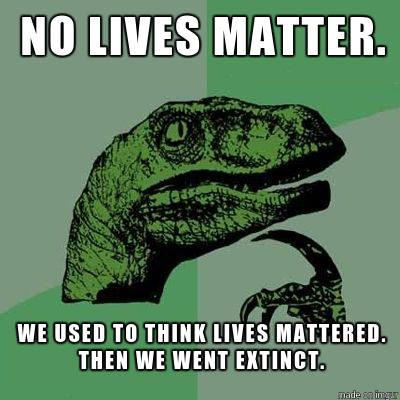

Yeah, that was me, circa 2016Q3, I'm ashamed to say.

## Mary the contractor

A story about Mary will go here.

## Blackish

My opinions about how middle-class African Americans are portrayed on TV will go here.

## Amazon delivery

A young man drove up in a U-Haul truck, last week, and blocked our driveway.
He emerged from the truck with a package bearing the Amazon smile.

"*Is this 1340?*", he asked.

"*No, 1340 is the next house South*", I replied.
He confirmed that the last name on the package was indeed our neighbors' to the South, and thanked me.

"*Be safe out there*", I advised him.

"*You too, brother*", he replied.

"Brother" ...  That label felt really good, given the current situation with rioting over how George Floyd was killed.

## White privilege

My lament about arriving late to the party will go here.
